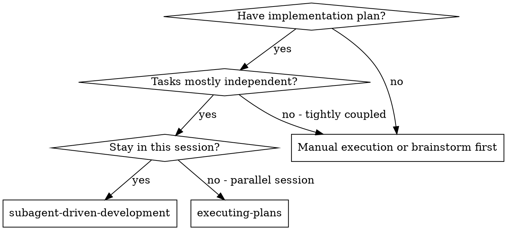
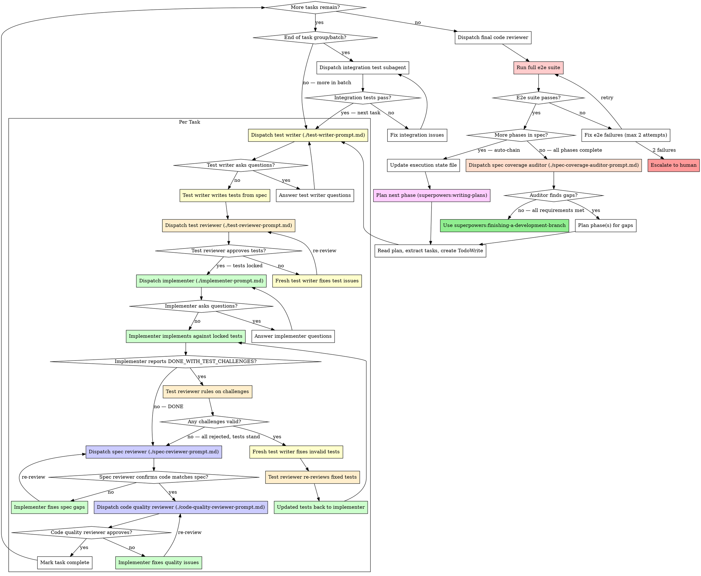

# Subagent-Driven Development

Execute plan by dispatching fresh subagent per task, with independent test writing, test review, implementation, and two-stage code review.

**Why subagents:** You delegate tasks to specialized agents with isolated context. By precisely crafting their instructions and context, you ensure they stay focused and succeed at their task. They should never inherit your session's context or history — you construct exactly what they need. This also preserves your own context for coordination work.

**Core principle:** Separate test writing from implementation + independent review at every stage = tests that catch real bugs, not tests that validate implementation assumptions

## When to Use



**vs. Executing Plans (parallel session):**
- Same session (no context switch)
- Fresh subagent per task (no context pollution)
- Two-stage review after each task: spec compliance first, then code quality
- Faster iteration (no human-in-loop between tasks)

## The Process



## Test Writing Before Implementation

The test writer works from the spec only and must not see implementation code. This is not a suggestion — it is a structural defense against confirmation bias. When one agent writes both tests and implementation, it encodes its misunderstanding in both. The `fire()`/`Clear()`/`IsCleared()` failure mode is the canonical example.

**What the test writer receives:**
1. The full task spec (pasted, not a file reference)
2. The test quality gold standard (`../test-driven-development/test-quality-gold-standard.md` — paste the full text)
3. Context about language, test framework, available components from previous tasks

**What the test writer does NOT receive:**
- Implementation code from any task
- Implementer notes, drafts, or reports
- The code quality reviewer's feedback

**Test writer produces:** test files with both confirming and falsifying tests, each mapped to the spec requirement it verifies.

## Test Review Before Implementation

The test reviewer independently derives expected behavior from the spec BEFORE reading the tests. This prevents anchoring to the writer's blind spots.

**What the test reviewer receives:**
1. The full task spec
2. The test quality gold standard
3. The test writer's report and test files

**The reviewer's process:**
1. Read spec → write down independent expectations (BEFORE opening tests)
2. Read tests → compare against independent expectations
3. Check every assertion traces to a spec requirement
4. Identify falsification gaps (shortcuts that would pass all tests)

**Important:** provide the spec inline in the prompt, but provide test files as paths. This forces the agent to derive expectations before it can see the tests — a real structural defense, not just an instruction.

**If tests need revision:** dispatch a FRESH test writer subagent with specific fix instructions (not the original writer — fresh context prevents anchoring to the original approach).

## The Challenge Protocol

When an implementer believes a pre-written test is genuinely wrong, they report DONE_WITH_TEST_CHALLENGES. The controller handles this:

1. **Test reviewer rules on each challenge.** The reviewer reads the challenge evidence, compares against the spec, and rules: valid (test is wrong) or invalid (implementer is wrong).

2. **If any challenge is valid:** dispatch a FRESH test writer subagent to fix the invalid tests. Then dispatch the test reviewer to re-review. Then return the updated tests to the implementer.

3. **If all challenges are invalid:** the tests stand. Re-dispatch the implementer with the ruling and instruction to make the tests pass. If the implementer cannot, escalate to the human.

4. **If the challenge loop exceeds 2 iterations:** escalate to the human. Something fundamental is unclear.

**Valid challenges require evidence:** the test name, the spec quote it claims to verify, and a specific explanation of why the test contradicts the spec. "It's hard" is not a valid challenge.

## Model Selection

Use the least powerful model that can handle each role to conserve cost and increase speed.

**Test writing** (from clear spec, mechanical application of gold standard rules): fast, cheap model.

**Test review** (judgment, independent derivation, oracle audit): most capable model. This is where quality is enforced.

**Mechanical implementation tasks** (isolated functions, clear specs, 1-2 files): use a fast, cheap model. Most implementation tasks are mechanical when the plan is well-specified.

**Integration and judgment tasks** (multi-file coordination, pattern matching, debugging): use a standard model.

**Architecture, design, and review tasks**: use the most capable available model.

**Task complexity signals:**
- Touches 1-2 files with a complete spec → cheap model
- Touches multiple files with integration concerns → standard model
- Requires design judgment or broad codebase understanding → most capable model

## Handling Implementer Status

Implementer subagents report one of five statuses. Handle each appropriately:

**DONE:** Proceed to spec compliance review.

**DONE_WITH_CONCERNS:** The implementer completed the work but flagged doubts. Read the concerns before proceeding. If the concerns are about correctness or scope, address them before review. If they're observations (e.g., "this file is getting large"), note them and proceed to review.

**DONE_WITH_TEST_CHALLENGES:** The implementer completed the work but believes one or more pre-written tests are incorrect. All non-challenged tests must pass. Handle via the Challenge Protocol (see above): test reviewer rules on each challenge → if valid, fresh test writer fixes → test reviewer re-reviews → updated tests back to implementer.

**NEEDS_CONTEXT:** The implementer needs information that wasn't provided. Provide the missing context and re-dispatch.

**BLOCKED:** The implementer cannot complete the task. Assess the blocker:
1. If it's a context problem, provide more context and re-dispatch with the same model
2. If the task requires more reasoning, re-dispatch with a more capable model
3. If the task is too large, break it into smaller pieces
4. If the plan itself is wrong, escalate to the human

**Never** ignore an escalation or force the same model to retry without changes. If the implementer said it's stuck, something needs to change.

## Integration Verification Between Batches

After completing a group of related tasks (a "batch"), dispatch an integration test subagent before moving to the next batch. This is not optional.

**Why:** Each subagent tests its own component in isolation. The connections between components — event flow, state propagation, interface contracts — are untested. This is where the bugs hide. Integration tests catch them before they compound.

**What the integration test subagent does:**
1. Reads the components built in the completed batch
2. Writes integration tests that wire up REAL components (no mocks for things just built)
3. Tests user-visible behavior through the real component chain
4. Tests that state flows correctly between components (focus, events, data)
5. Runs all tests (unit + integration)
6. Commits

**When to dispatch:**
- After every batch boundary in the plan
- After any task that implements an interface consumed by a previously-built component
- Before moving to a new subsystem that depends on the one just built

**Example prompt for integration test subagent:**
```
Write integration tests for the components built in Batch 2 (Group, Window, Desktop).
Test that:
1. A keystroke injected at the Application level reaches a Button inside a Window
2. Focus propagation works through the real chain: Application → Desktop → Window → Button
3. ExecView on a Dialog renders the dialog visibly and returns the correct command
Use real components, not mocks. Read the existing code to understand the APIs.
```

**If integration tests reveal bugs:** Fix them before proceeding. A bug at the seam between components will only get harder to fix as more code builds on top of it.

## Multi-Phase Auto-Chaining

For projects that span multiple phases (spec covers subsystems planned and executed sequentially):

After all tasks in the current phase pass final review:
1. Update the execution state file (see below)
2. Invoke `superpowers:writing-plans` for the next phase:
   - Provide the original spec
   - Reference completed phases and their real code (not the plan text — the actual built codebase)
   - The planner reads the codebase to understand what exists, then plans the next subsystem
3. After the plan reviewer approves, execute the new plan using this same workflow
4. Repeat until the spec is fully implemented (all phases pass e2e suite, spec coverage auditor reports no gaps)
5. Then invoke `superpowers:finishing-a-development-branch`

**Do not ask the user between phases.** If auto-chaining was selected at execution handoff, proceed automatically. The execution state file records this decision.

**When to stop auto-chaining and escalate to the user:**
- A phase fails final review after 2 fix attempts
- A plan reviewer rejects a phase plan after 2 revision attempts
- The controller cannot determine what the next phase should cover
- The spec coverage auditor reports all requirements met (proceed to finishing)

## E2E Suite as Phase Gate

After the final code reviewer approves and before auto-chaining to the next phase, run the project's full e2e test suite. This is the same suite that the plan's e2e test task built and extended — not a separate smoke test.

**What to run:** Build the project binary, execute the e2e test script/suite. This tests the actual application through its real interface (tmux for TUI, HTTP for web, subprocess for CLI).

**If the e2e suite passes:** proceed to auto-chaining (or finishing, if this is the last phase).

**If the e2e suite fails:** dispatch a fix subagent with the failure output and the relevant source files. Re-run the suite after the fix.

**If the e2e suite fails twice:** escalate to the human. Something fundamental is wrong that the automated pipeline can't resolve — likely a design issue in the plan, not a simple bug.

**Why this gate exists:** Unit and integration tests verify that components work in isolation and connect correctly. The e2e suite verifies that the actual application works when a user runs it. These are different things — turboview v2 had 1,326 passing unit/integration tests and 5 critical bugs that only appeared when running the app.

**E2E task pipeline.** The e2e task in each phase plan skips the test-writer and test-reviewer stages — it goes straight to implementer → spec review → code quality review. The e2e task IS a test (a shell script or automation that drives the app), so sending it through the test-writer pipeline is circular. The implementer writes or extends the e2e suite directly.

## Spec Coverage Auditor

After all planned phases complete and the e2e suite passes, dispatch an independent spec coverage auditor (see `./spec-coverage-auditor-prompt.md`). This agent reads the spec and the codebase with no context from the controller, and reports which requirements are implemented and which are not.

**Why independent:** The controller has been executing for hours. Its instruction-following may have degraded due to long context or compaction. A fresh agent with a single focused task — "what's missing?" — is more reliable than the controller self-assessing.

**What the auditor receives:**
- The spec file path
- The project root path

**What the auditor does NOT receive:**
- Controller conversation history
- Summaries of what was built
- The execution state file
- Plan documents

**If gaps are found:** Plan new phase(s) to address them using the normal workflow (writing-plans → subagent-driven-development). After execution, run the e2e suite, then dispatch the auditor again.

**Convergence:** The spec is finite, each phase closes gaps, the e2e suite prevents regressions. The loop terminates when the auditor reports no gaps.

## Execution State File

Maintain `docs/superpowers/plans/.execution-state.md` throughout execution. This file has two jobs: track progress, and provide full recovery context after context compaction.

**When to write/update:**
- When starting execution (after user selects execution approach)
- After each task completes (update task progress)
- After each phase completes
- Before and after planning each new phase

**Format:**

```markdown
# Execution State

**Workflow:** superpowers:subagent-driven-development
**Spec:** [absolute path to spec file]
**Auto-chain:** yes | no
**Started:** [date]

## Phases

| # | Plan | Status |
|---|------|--------|
| 1 | docs/superpowers/plans/YYYY-MM-DD-phase1-name.md | ✅ Complete |
| 2 | docs/superpowers/plans/YYYY-MM-DD-phase2-name.md | 🔄 Executing — Task 3 of 7 |
| 3 | [not yet planned] | ⏳ Next |

## Current

**Phase:** [N]
**Action:** [what to do next — "execute task 4", "plan phase 3", "run final review"]
**Context:** [1-2 sentences: what prior phases built, what this phase covers]

## Recovery After Compaction

If you are reading this after context compaction:

1. You MUST use superpowers:subagent-driven-development — dispatch subagents for ALL implementation, testing, and review work
2. Do NOT work inline or write code yourself — every task gets a fresh subagent
3. Read the spec at the path above for full project scope
4. Read completed phase plans to understand what has been built
5. Continue from the "Current" section above
6. After completing this phase, plan and execute the next one (if auto-chain is yes)
7. Update this file after every significant checkpoint
```

**CRITICAL: Read this file FIRST when starting any work.** If this file exists, you are mid-execution. Resume from where the file says you are. Do not re-plan completed phases. Do not switch to inline execution.

The Recovery section exists specifically for the post-compaction case where the controller's conversation history has been summarized and it may have lost track of the workflow, the phase structure, or the decision to use subagents.

## Prompt Templates

- `./test-writer-prompt.md` - Dispatch test writer subagent (spec + gold standard → tests)
- `./test-reviewer-prompt.md` - Dispatch test reviewer subagent (spec + gold standard + tests → review)
- `./implementer-prompt.md` - Dispatch implementer subagent (locked tests → implementation)
- `./spec-reviewer-prompt.md` - Dispatch spec compliance reviewer subagent
- `./code-quality-reviewer-prompt.md` - Dispatch code quality reviewer subagent
- `./spec-coverage-auditor-prompt.md` - Dispatch spec coverage auditor (spec + codebase → gap report)

**Gold standard reference:** `../test-driven-development/test-quality-gold-standard.md` — paste full text to test writer and test reviewer subagents.

## Example Workflow

```
You: I'm using Subagent-Driven Development to execute this plan.

[Read plan file once: docs/superpowers/plans/feature-plan.md]
[Read gold standard once: ../test-driven-development/test-quality-gold-standard.md]
[Extract all 5 tasks with full text and context]
[Create TodoWrite with all tasks]

Task 1: Hook installation script

--- Test Writing ---

[Dispatch test writer with Task 1 spec text + gold standard text + context]

Test writer:
  - Wrote 6 tests: 4 confirming, 2 falsifying
  - Each test mapped to a spec requirement
  - DONE

[Dispatch test reviewer with spec + gold standard + test files]

Test reviewer:
  - Independent derivation: expected 7 tests, writer has 6
  - Missing: boundary test for --force when hook already exists
  - Oracle audit: 6/6 specified oracles ✅
  - Smell scan: clean
  - ⚠️ Approved with notes: add the --force boundary test

[Dispatch fresh test writer to add the missing test]
[Test reviewer re-reviews: ✅ Approved — tests locked]

--- Implementation ---

[Dispatch implementer with Task 1 spec + locked test files]

Implementer:
  - All 7 tests pass
  - Self-review: clean
  - DONE

[Dispatch spec compliance reviewer]
Spec reviewer: ✅ Spec compliant

[Dispatch code quality reviewer]
Code reviewer: ✅ Approved

[Mark Task 1 complete]

Task 2: Recovery modes

--- Test Writing ---

[Dispatch test writer with Task 2 spec + gold standard]

Test writer:
  - 10 tests written
  - DONE

[Test reviewer: ✅ Approved — tests locked]

--- Implementation ---

[Dispatch implementer with locked tests]

Implementer:
  - 9/10 tests pass
  - DONE_WITH_TEST_CHALLENGES:
    Challenge: test_progress_reports_every_100_items asserts exact "100 of 500"
    message format, but spec says "report progress" without specifying format.
    Spec quote: "report every 100 items." Test expects specific string.

--- Challenge Protocol ---

[Dispatch test reviewer to rule on challenge]
Test reviewer: Valid — spec doesn't mandate string format. Test should assert
  that progress was reported 5 times for 500 items, not check exact wording.

[Dispatch fresh test writer to fix the test]
[Test reviewer re-reviews: ✅ Fixed test approved]

[Return updated tests to implementer]
Implementer: 10/10 pass now. DONE.

[Spec reviewer: ✅]
[Code reviewer: ✅]
[Mark Task 2 complete]

--- End of Batch 1 ---

[Dispatch integration test subagent]
Integration tests: ✅ Hook install + recovery modes work together

...

[After all tasks]
[Dispatch final code-reviewer]
Final reviewer: All requirements met, ready to merge

Done!
```

## Advantages

**vs. Manual execution:**
- Subagents follow TDD naturally
- Fresh context per task (no confusion)
- Parallel-safe (subagents don't interfere)
- Subagent can ask questions (before AND during work)

**vs. Executing Plans:**
- Same session (no handoff)
- Continuous progress (no waiting)
- Review checkpoints automatic

**Efficiency gains:**
- No file reading overhead (controller provides full text)
- Controller curates exactly what context is needed
- Subagent gets complete information upfront
- Questions surfaced before work begins (not after)

**Quality gates:**
- Self-review catches issues before handoff
- Two-stage review: spec compliance, then code quality
- Review loops ensure fixes actually work
- Spec compliance prevents over/under-building
- Code quality ensures implementation is well-built

**Cost:**
- More subagent invocations (implementer + 2 reviewers per task)
- Controller does more prep work (extracting all tasks upfront)
- Review loops add iterations
- But catches issues early (cheaper than debugging later)

## Red Flags

**Never:**
- Start implementation on main/master branch without explicit user consent
- Skip test writing or test review stages
- Let the implementer see tests before they're locked (information asymmetry is structural)
- Let the implementer modify locked tests (use DONE_WITH_TEST_CHALLENGES instead)
- Let the test reviewer read tests before independently deriving expectations from spec
- Skip reviews (spec compliance OR code quality)
- Proceed with unfixed issues
- Dispatch multiple implementation subagents in parallel (conflicts)
- Make subagent read plan file (provide full text instead)
- Skip scene-setting context (subagent needs to understand where task fits)
- Ignore subagent questions (answer before letting them proceed)
- Accept "close enough" on spec compliance (spec reviewer found issues = not done)
- Skip review loops (reviewer found issues = implementer fixes = review again)
- Let implementer self-review replace actual review (both are needed)
- **Start code quality review before spec compliance is ✅** (wrong order)
- Move to next task while either review has open issues
- Reuse the same test writer subagent to fix test issues (dispatch a fresh one to prevent anchoring)
- Fall back to inline execution after context compaction (ALWAYS dispatch subagents — read the execution state file if unsure)
- Skip updating the execution state file at checkpoints (this is what saves you after compaction)
- Skip the e2e suite gate between phases (this catches bugs that unit and integration tests miss)

**If subagent asks questions:**
- Answer clearly and completely
- Provide additional context if needed
- Don't rush them into implementation

**If reviewer finds issues:**
- Implementer (same subagent) fixes them
- Reviewer reviews again
- Repeat until approved
- Don't skip the re-review

**If test challenges are raised:**
- Test reviewer rules on each challenge with evidence
- Valid challenges → fresh test writer fixes → test reviewer re-reviews
- Invalid challenges → tests stand, implementer must make them pass
- Never let an implementer's "it's hard" override a locked test

**If subagent fails task:**
- Dispatch fix subagent with specific instructions
- Don't try to fix manually (context pollution)

## Integration

**Required workflow skills:**
- **superpowers:using-git-worktrees** - REQUIRED: Set up isolated workspace before starting
- **superpowers:writing-plans** - Creates the plan this skill executes
- **superpowers:requesting-code-review** - Code review template for reviewer subagents
- **superpowers:finishing-a-development-branch** - Complete development after all phases

**Subagents should use:**
- **superpowers:test-driven-development** - Subagents follow TDD for each task

**Alternative workflow:**
- **superpowers:executing-plans** - Use for parallel session instead of same-session execution
